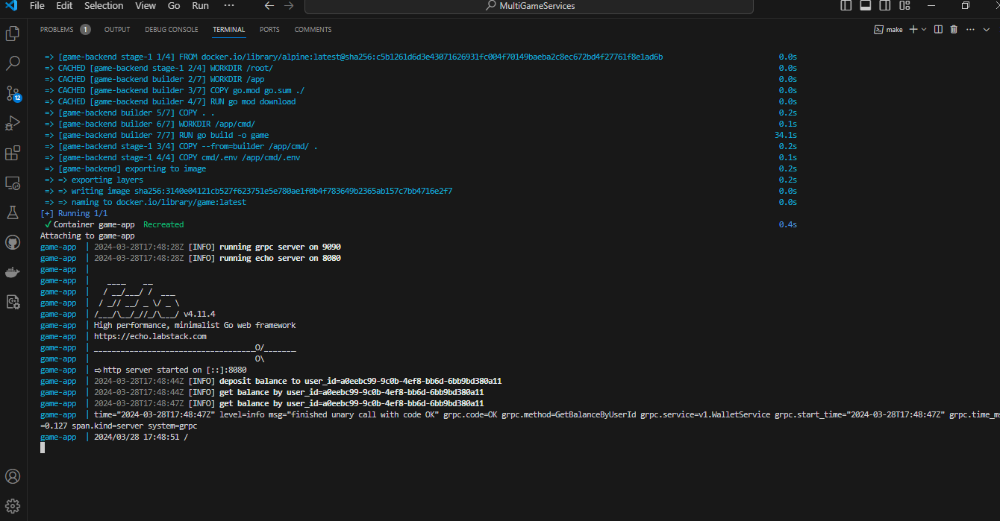
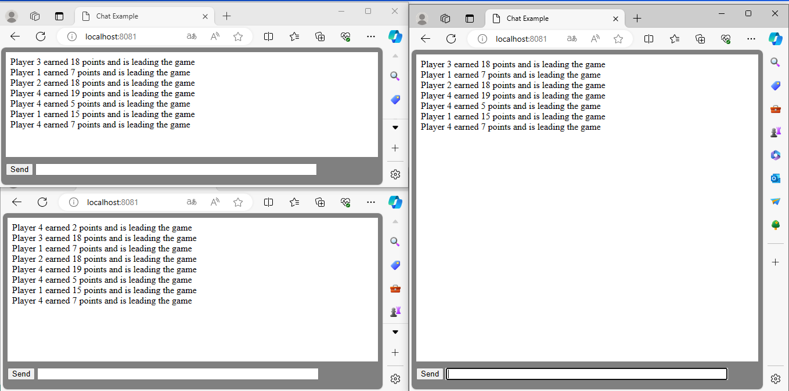

# GameService

## About project
- Three servers are implemented in the project: http, gRPC and WebSocket;
- For data storage in-memory-cache was used (data type `uuid` (user id) was chosen as the key, and `int` was chosen to store the amount of money for optimal storage (data type `float` can be implemented for input and multiplied by 100));
- To limit the storage of data in the cache, the time must be set `ttl`;
- The project is logged (writes to the console by default);
- The project is dockerized and a multistage docker file is used;

##  Startup instructions
Docker-compose is required to run the project.

`docker-compose up --build --remove-orphans` or `make run`

Proto files are located in the proto directory, to start run `make run`

## API
- REST Endpoint = `http://localhost:8080/`
- gRPC Endpoints = `0.0.0.0:9090` (In Postman, use gRPC format requests with Proto file loading)
- WebSocket = `http://localhost:8081/`

## A picture is worth a thousand words

